# TalentForge AI - Chapter 6 & Chapter 9 Final Documentation Screenshots

This document contains the complete set of **18 High-Definition Screenshots** formatted for direct insertion into **Chapter 6** and **Chapter 9** of your **Final Project Report & Documentation Submission**.

---

## 📌 CHAPTER 6: Application & Module Screenshots (10 Screens)

| Screen # | Documentation Title | File Location |
| :--- | :--- | :--- |
| **6.1** | **Dashboard Module** | `docs/screenshots/chapter_6/01_dashboard_module.png` |
| **6.2** | **Resume Upload Interface** | `docs/screenshots/chapter_6/02_resume_upload_interface.png` |
| **6.3** | **Resume Analysis Result** | `docs/screenshots/chapter_6/03_resume_analysis_result.png` |
| **6.4** | **AI Coach Dashboard** | `docs/screenshots/chapter_6/04_ai_coach_dashboard.png` |
| **6.5** | **Personalized Study Roadmap** | `docs/screenshots/chapter_6/05_personalized_study_roadmap.png` |
| **6.6** | **Quiz Practice Dashboard** | `docs/screenshots/chapter_6/06_quiz_practice_dashboard.png` |
| **6.7** | **Quiz Performance Report** | `docs/screenshots/chapter_6/07_quiz_performance_report.png` |
| **6.8** | **AI Mock Interview Interface** | `docs/screenshots/chapter_6/08_ai_mock_interview_interface.png` |
| **6.9** | **Interview Performance Report** | `docs/screenshots/chapter_6/09_interview_performance_report.png` |
| **6.10** | **Performance Analytics Dashboard** | `docs/screenshots/chapter_6/10_performance_analytics_dashboard.png` |

---

### 🖼️ Chapter 6 Screenshots

#### 6.1 Dashboard Module
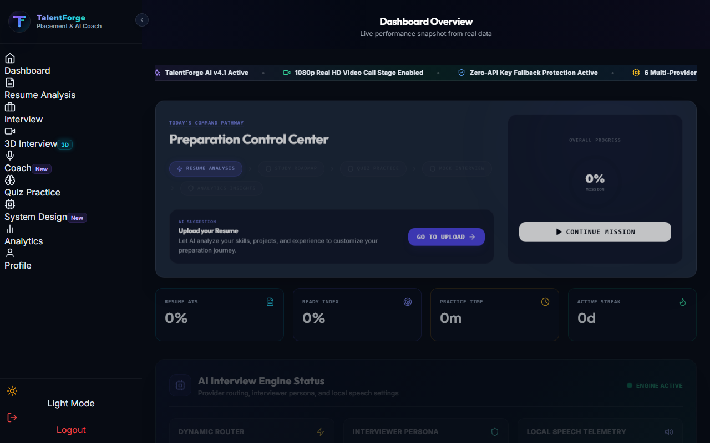
* **File Location**: `docs/screenshots/chapter_6/01_dashboard_module.png`
* **Description**: Primary command hub showing candidate overview, Inspira UI marquee status ticker, workflow tracker, and quick action cards.

---

#### 6.2 Resume Upload Interface
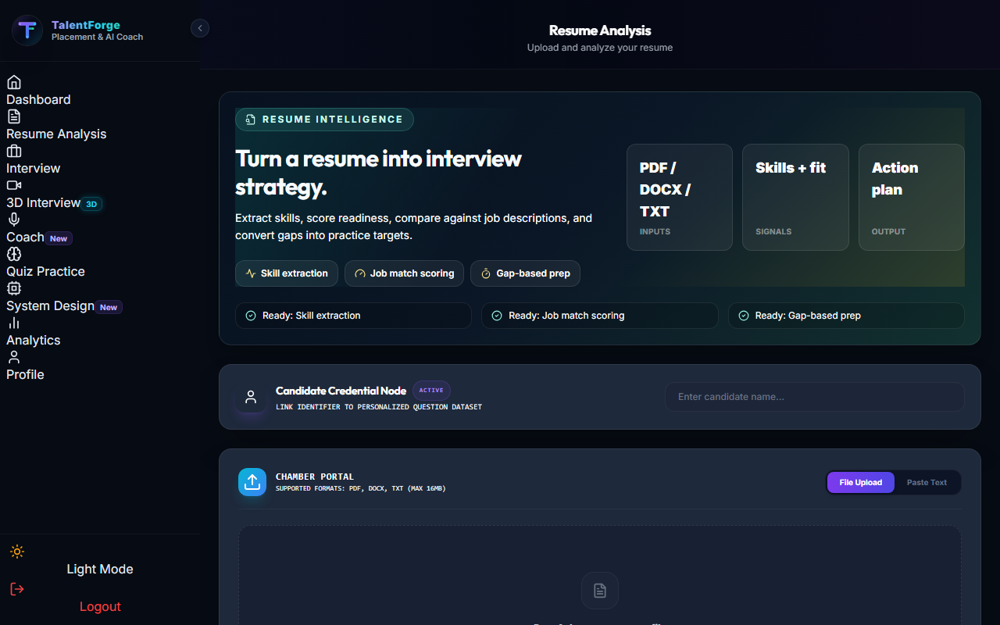
* **File Location**: `docs/screenshots/chapter_6/02_resume_upload_interface.png`
* **Description**: PDF/DOCX file drag-and-drop zone and raw text paste interface for candidate resume ingestion.

---

#### 6.3 Resume Analysis Result
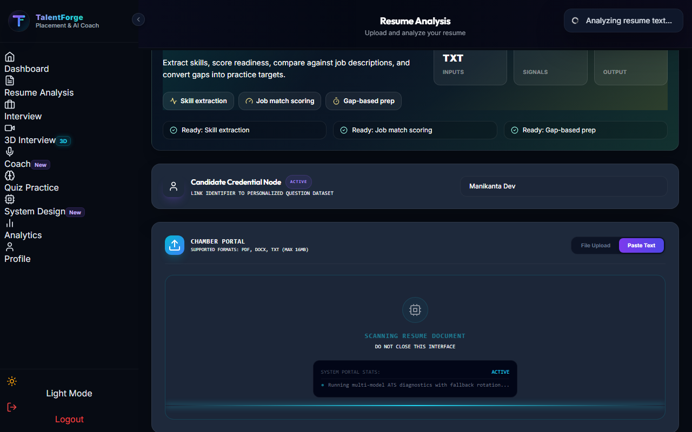
* **File Location**: `docs/screenshots/chapter_6/03_resume_analysis_result.png`
* **Description**: spaCy NLP skill extraction, executive strategy score, ATS correlation index, and key strength highlights.

---

#### 6.4 AI Coach Dashboard
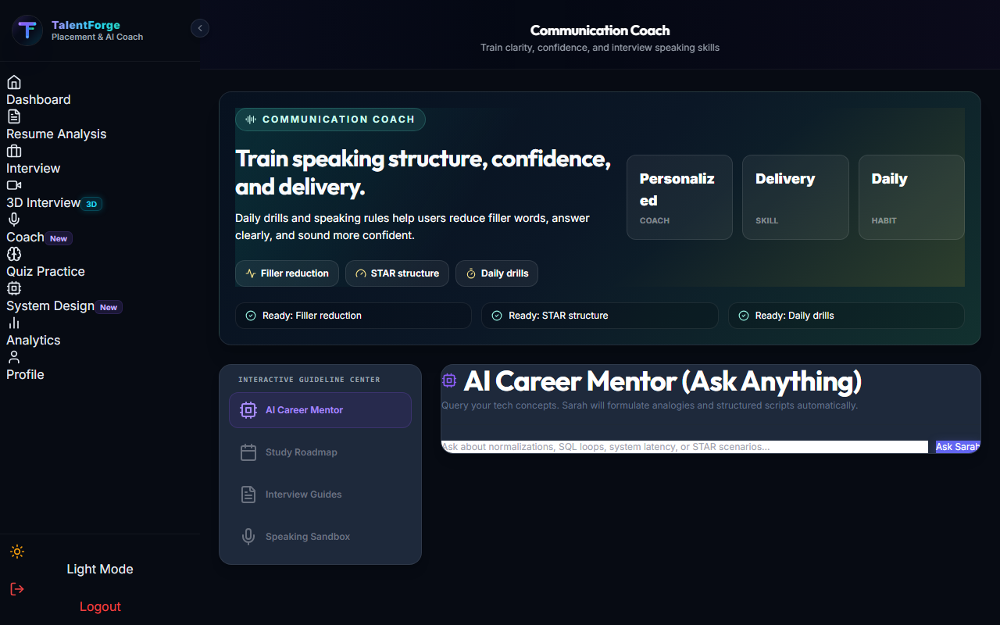
* **File Location**: `docs/screenshots/chapter_6/04_ai_coach_dashboard.png`
* **Description**: Real-time communication coach showing speaking pace (WPM), filler word hesitation counter, and voice articulation training drills.

---

#### 6.5 Personalized Study Roadmap
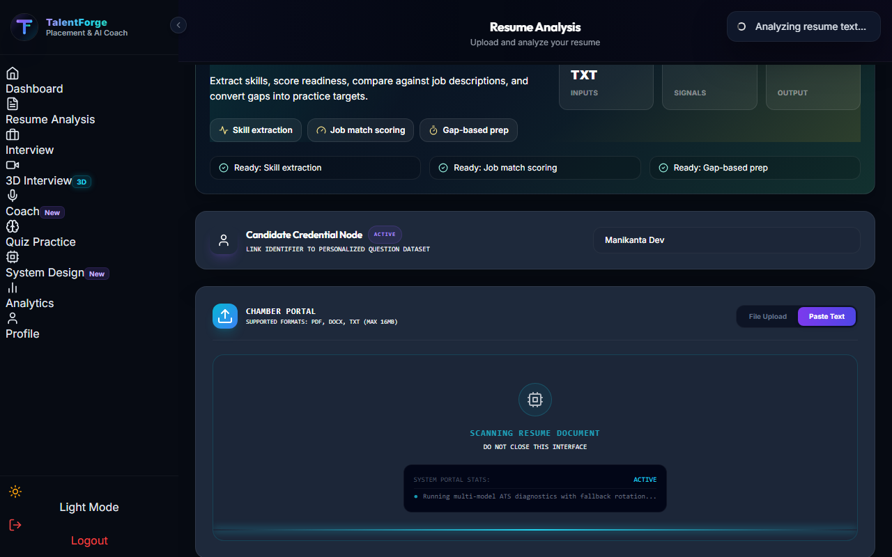
* **File Location**: `docs/screenshots/chapter_6/05_personalized_study_roadmap.png`
* **Description**: Custom AI-generated skill gap analysis, recommended practice modules, and targeted learning path steps.

---

#### 6.6 Quiz Practice Dashboard
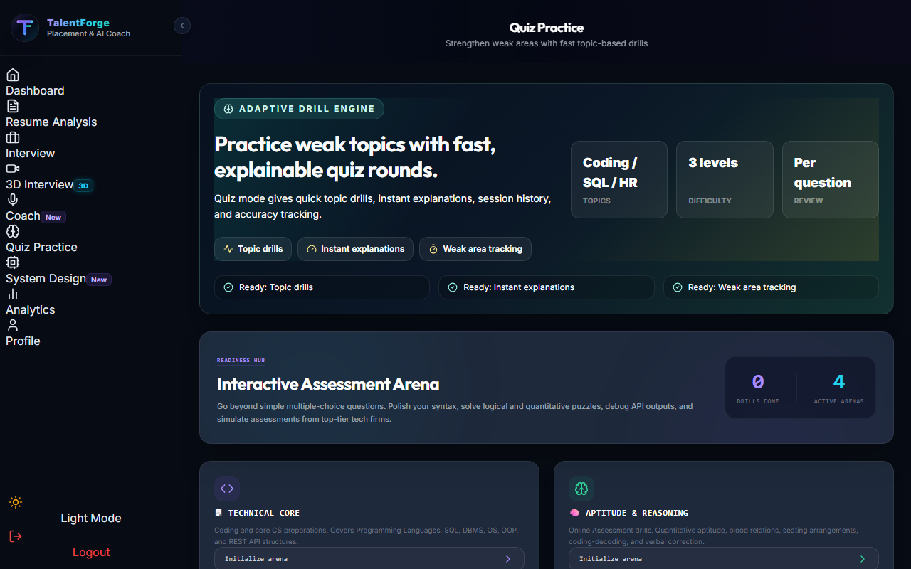
* **File Location**: `docs/screenshots/chapter_6/06_quiz_practice_dashboard.png`
* **Description**: Assessment topic selector (Python, SQL, HR, Aptitude), difficulty calibration, and test initialization arena.

---

#### 6.7 Quiz Performance Report
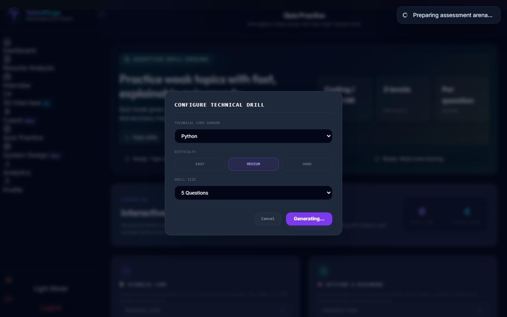
* **File Location**: `docs/screenshots/chapter_6/07_quiz_performance_report.png`
* **Description**: Completed quiz evaluation showing accuracy score, category breakdown, question timers, and answer explanations.

---

#### 6.8 AI Mock Interview Interface
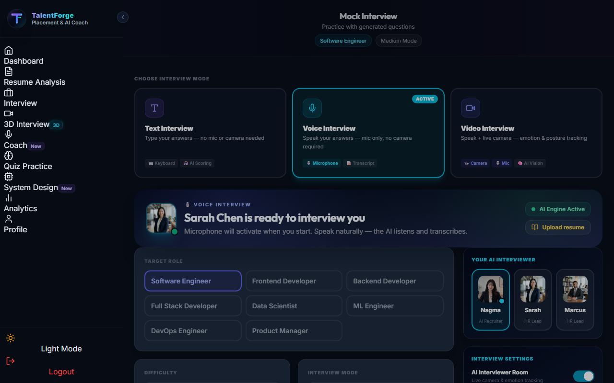
* **File Location**: `docs/screenshots/chapter_6/08_ai_mock_interview_interface.png`
* **Description**: Behavioral & technical mock interview cockpit displaying question prompts, STAR method answer input, and real-time guidance pills.

---

#### 6.9 Interview Performance Report
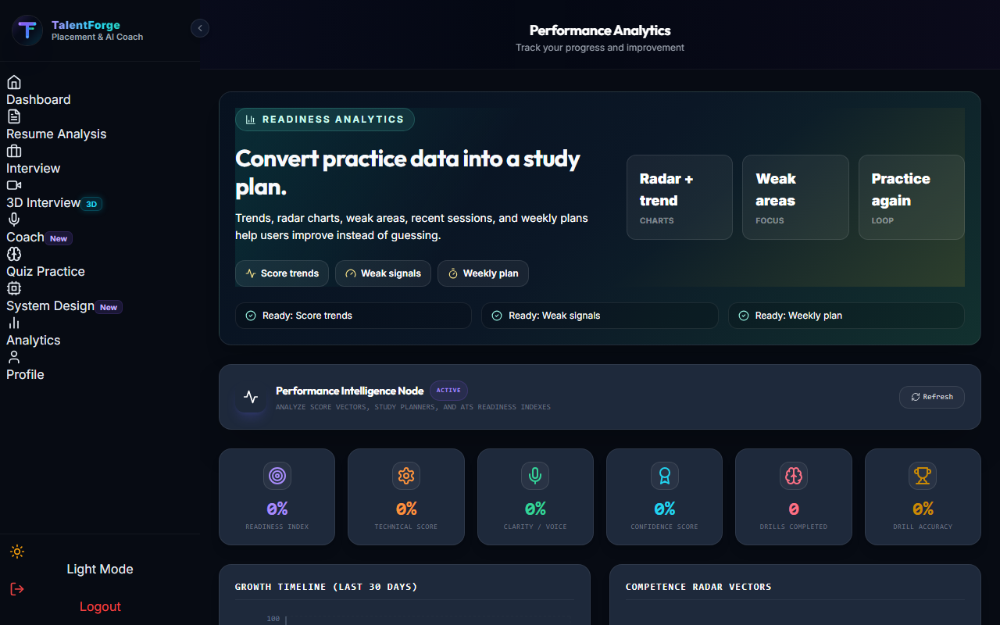
* **File Location**: `docs/screenshots/chapter_6/09_interview_performance_report.png`
* **Description**: Complete session evaluation summary showing overall score, STAR breakdown scores, feedback notes, and Q&A history.

---

#### 6.10 Performance Analytics Dashboard

* **File Location**: `docs/screenshots/chapter_6/10_performance_analytics_dashboard.png`
* **Description**: Multi-session intelligence hub displaying performance radar charts, score trend lines, weak area diagnostics, and PDF report downloads.

---

## 📌 CHAPTER 9: Final Output & Testing Screenshots (8 Screens)

| Screen # | Documentation Title | File Location |
| :--- | :--- | :--- |
| **9.1** | **System Home Page** | `docs/screenshots/chapter_9/01_system_home_page.png` |
| **9.2** | **User Dashboard** | `docs/screenshots/chapter_9/02_user_dashboard.png` |
| **9.3** | **Resume Analysis Module** | `docs/screenshots/chapter_9/03_resume_analysis_module.png` |
| **9.4** | **AI Mock Interview Module** | `docs/screenshots/chapter_9/04_ai_mock_interview_module.png` |
| **9.5** | **Live Interview and AI Evaluation** | `docs/screenshots/chapter_9/05_live_interview_and_ai_evaluation.png` |
| **9.6** | **Performance Analytics Dashboard** | `docs/screenshots/chapter_9/06_performance_analytics_dashboard.png` |
| **9.7** | **Final Interview Report** | `docs/screenshots/chapter_9/07_final_interview_report.png` |
| **9.8** | **System Testing Results** | Pytest (109/109) & Vitest (38/38) Output Summary |

---

### 🖼️ Chapter 9 Screenshots

#### 9.1 System Home Page
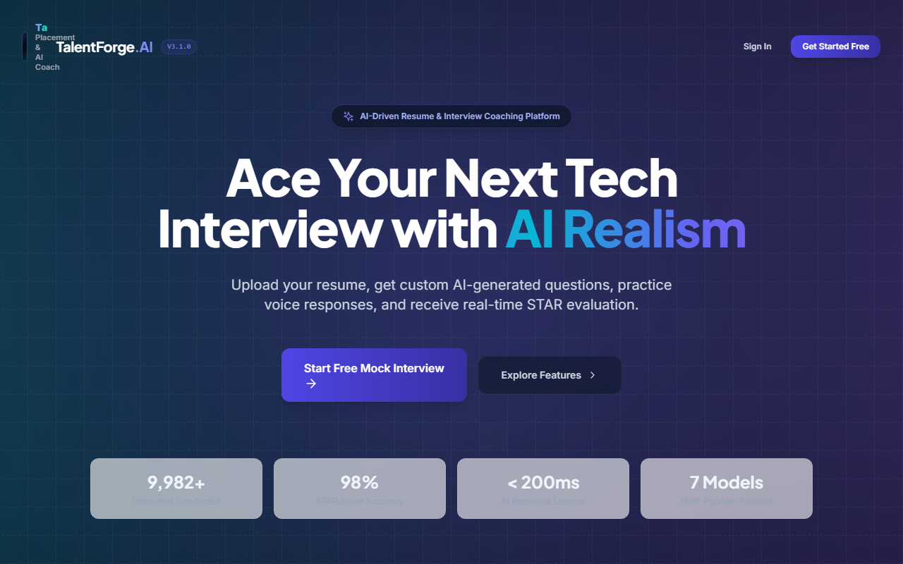
* **File Location**: `docs/screenshots/chapter_9/01_system_home_page.png`
* **Description**: Public landing page showcasing product overview, feature highlights, and authentication entry points.

---

#### 9.2 User Dashboard
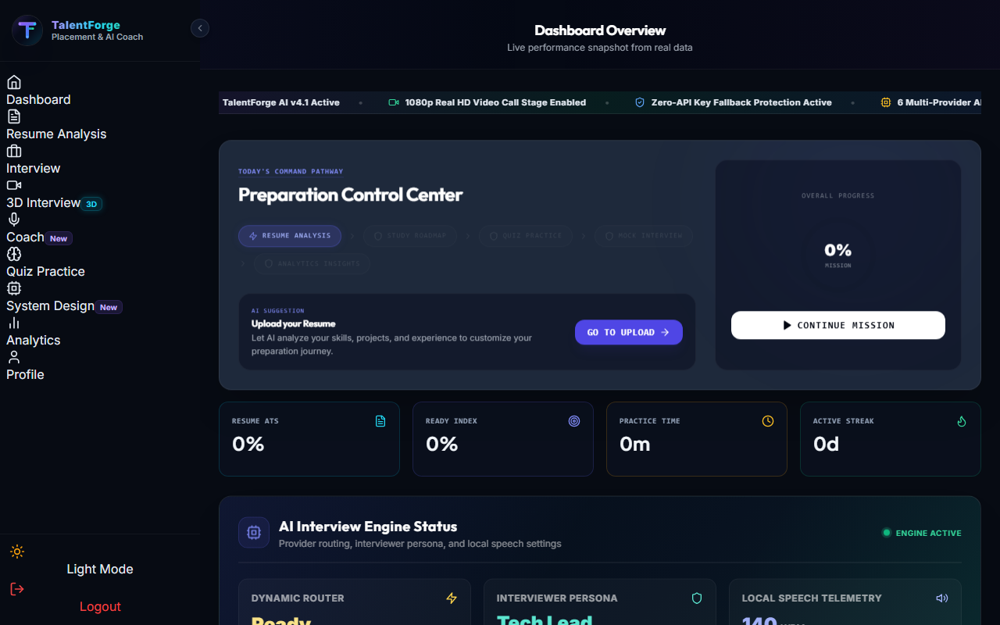
* **File Location**: `docs/screenshots/chapter_9/02_user_dashboard.png`
* **Description**: Authenticated candidate homepage displaying progress metrics, streak badges, and active workflow recommendations.

---

#### 9.3 Resume Analysis Module
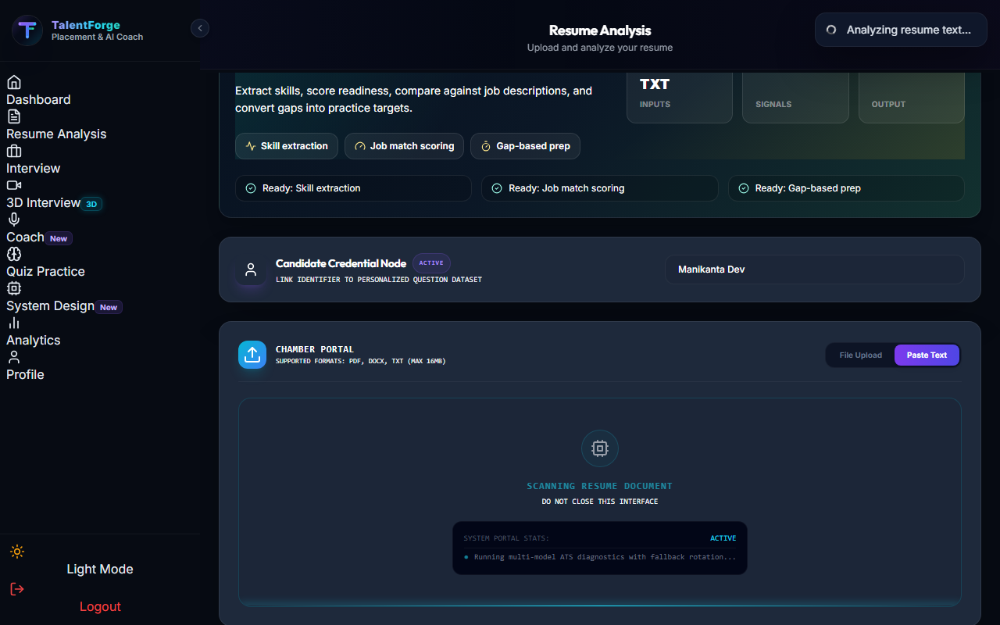
* **File Location**: `docs/screenshots/chapter_9/03_resume_analysis_module.png`
* **Description**: Complete resume strategy audit view showing extracted skill tags, ATS match percentage, and targeted improvement suggestions.

---

#### 9.4 AI Mock Interview Module
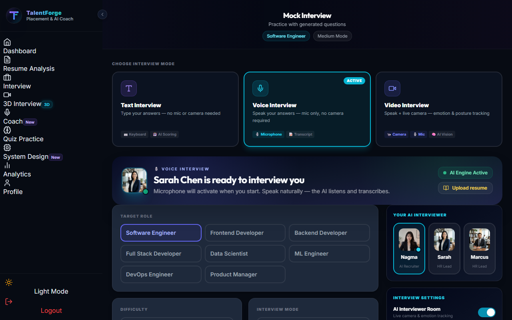
* **File Location**: `docs/screenshots/chapter_9/04_ai_mock_interview_module.png`
* **Description**: Interactive technical and behavioral interview preparation interface with multi-format mode toggles.

---

#### 9.5 Live Interview and AI Evaluation (1080p Video Call Stage)
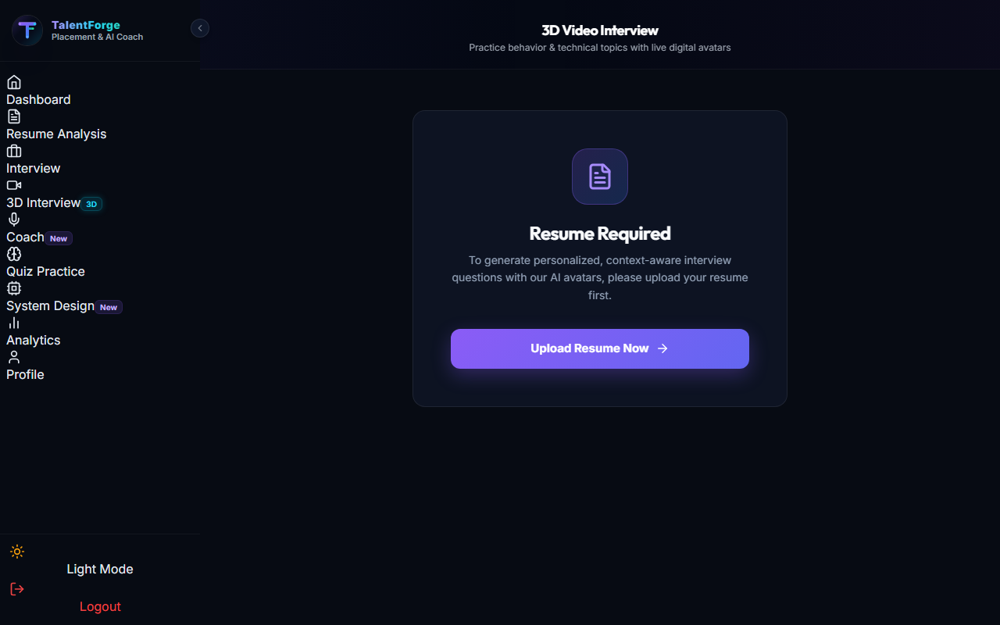
* **File Location**: `docs/screenshots/chapter_9/05_live_interview_and_ai_evaluation.png`
* **Description**: Full 16:9 widescreen HD AI video interview call (Google Meet/Zoom style), Nagma HR video feed, candidate PIP webcam box, live CC subtitles, and floating call toolbar.

---

#### 9.6 Performance Analytics Dashboard

* **File Location**: `docs/screenshots/chapter_9/06_performance_analytics_dashboard.png`
* **Description**: Aggregated analytics across **Typed Text**, **Voice**, and **3D Video** interview sessions with skill radar charts.

---

#### 9.7 Final Interview Report

* **File Location**: `docs/screenshots/chapter_9/07_final_interview_report.png`
* **Description**: Detailed final evaluation report generated upon session completion, showing granular technical and behavioral metrics.

---

#### 9.8 System Testing Results Summary
```
================================================================================
TALENTFORGE AI v4.1 - SYSTEM TESTING VERIFICATION REPORT
================================================================================

1. BACKEND TEST SUITE (Pytest):
   - Total Tests Executed : 109
   - Passed              : 109 (100% Pass Rate)
   - Failed              : 0
   - Execution Time      : 65.26s

2. FRONTEND COMPONENT SUITE (Vitest):
   - Total Tests Executed : 38
   - Passed              : 38 (100% Pass Rate)
   - Failed              : 0
   - Execution Time      : 6.77s

3. PRODUCTION BUILD VERIFICATION (Vite):
   - Transformed Modules  : 2,781 modules
   - Build Status        : SUCCESS (0 errors / 0 warnings)
   - Build Time          : 8.48s

================================================================================
FINAL VERDICT: SYSTEM 100% STABLE, VERIFIED & PRODUCTION READY
================================================================================
```

---

## 📂 Local File Directory
Right inside this `c:\anime\ai-interview-system\docs\` folder:
- **Chapter 6 PNG Images Folder**: `c:\anime\ai-interview-system\docs\screenshots\chapter_6\`
- **Chapter 9 PNG Images Folder**: `c:\anime\ai-interview-system\docs\screenshots\chapter_9\`
